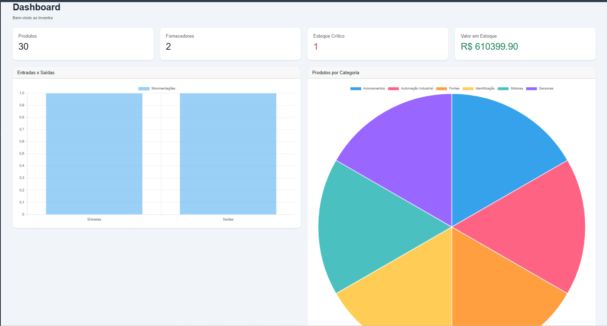
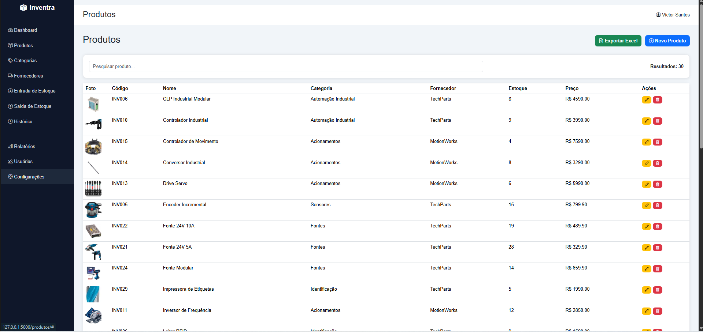
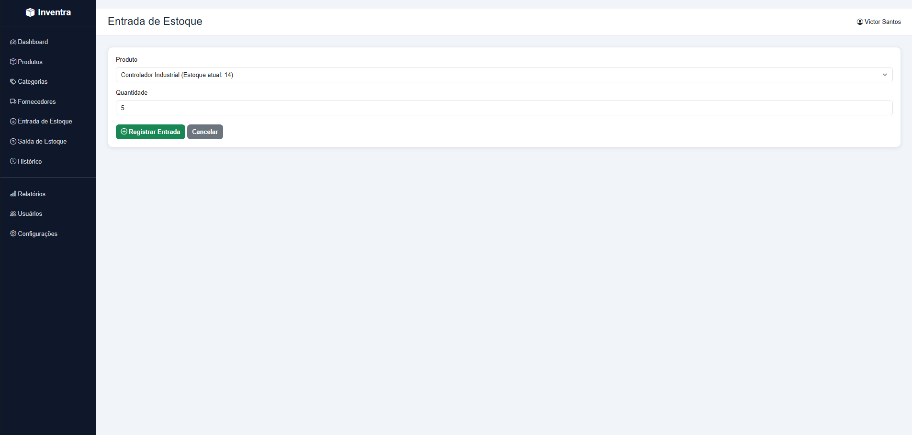

# Inventra

Sistema web de gerenciamento de estoque desenvolvido em Python com Flask.

O Inventra é uma aplicação voltada à simulação de operações de controle de estoque em um ambiente administrativo, permitindo gerenciar produtos, fornecedores, categorias e movimentações de entrada e saída.

O projeto aplica conceitos de desenvolvimento backend, persistência de dados, autenticação de usuários, organização em camadas e construção de interfaces administrativas.

---

## Funcionalidades

### Autenticação

- Login de usuários
- Controle de sessão
- Usuário administrador

### Gestão de Produtos

- Cadastro, edição e exclusão de produtos
- Pesquisa de produtos
- Controle de quantidade em estoque
- Definição de estoque mínimo
- Associação de produtos com categorias e fornecedores
- Upload de imagens de produtos

### Controle de Estoque

- Registro de entrada de produtos
- Registro de saída de produtos
- Histórico de movimentações
- Atualização da quantidade disponível em estoque

### Categorias e Fornecedores

- Cadastro e gerenciamento de categorias
- Cadastro e gerenciamento de fornecedores
- Associação de produtos a categorias e fornecedores

### Dashboard

Painel administrativo com informações gerais do estoque, incluindo:

- Quantidade de produtos cadastrados
- Quantidade de fornecedores
- Produtos com estoque crítico
- Valor total do estoque
- Indicadores de movimentação

### Relatórios

- Exportação de produtos para Excel
- Geração de relatórios em PDF

---

## Tecnologias utilizadas

### Backend

- Python
- Flask
- SQLAlchemy
- Werkzeug

### Banco de Dados

- SQLite

### Frontend

- HTML5
- CSS3
- JavaScript
- Bootstrap

### Relatórios e arquivos

- OpenPyXL
- ReportLab

### Versionamento

- Git
- GitHub

---

## Estrutura do projeto

```text
Inventra/
├── app.py
├── config.py
├── database.py
├── criar_admin.py
├── popular_banco.py
├── models/
├── routes/
├── services/
├── templates/
├── static/
├── Screenshots/
└── requirements.txt
```

A aplicação separa responsabilidades entre modelos, rotas, serviços, templates e configuração do banco de dados.

---

## Dados de demonstração

O projeto utiliza dados fictícios para demonstração das funcionalidades.

Um usuário local de demonstração pode ser criado por meio do script:

```bash
python criar_admin.py
```

Credenciais de demonstração:

```text
Email: demo@inventra.local
Senha: inventra-demo
```

Essas credenciais são destinadas exclusivamente ao ambiente local de demonstração.

Os fornecedores, produtos, valores e quantidades utilizados para popular o banco também são dados fictícios.

---

## Como executar

### 1. Clone o repositório

```bash
git clone https://github.com/victorsantos-tech/Inventra.git
```

### 2. Acesse o diretório

```bash
cd Inventra
```

### 3. Crie um ambiente virtual

No Windows:

```bash
python -m venv venv
```

### 4. Ative o ambiente virtual

No PowerShell:

```powershell
.\venv\Scripts\Activate.ps1
```

### 5. Instale as dependências

```bash
python -m pip install -r requirements.txt
```

### 6. Crie o usuário de demonstração

```bash
python criar_admin.py
```

### 7. Opcionalmente, popule o banco com dados de demonstração

```bash
python popular_banco.py
```

### 8. Execute a aplicação

```bash
python app.py
```

A aplicação estará disponível em:

```text
http://127.0.0.1:5000
```

---

## Screenshots

### Dashboard



### Gestão de Produtos



### Entrada de Estoque



---

## Objetivo do projeto

O Inventra foi desenvolvido como projeto prático para aplicar conceitos de engenharia de software e desenvolvimento web em um sistema administrativo.

Entre os conceitos aplicados estão:

- Desenvolvimento backend com Flask
- Modelagem e persistência de dados com SQLAlchemy
- Operações CRUD
- Autenticação e controle de sessão
- Organização da aplicação em módulos
- Regras de movimentação de estoque
- Geração de documentos PDF
- Exportação de dados para Excel
- Desenvolvimento de interface administrativa

O sistema utiliza dados simulados e não representa uma aplicação de produção ou uma solução vinculada a uma empresa específica.

---

## Autor

Victor Hugo dos Santos

Engenharia de Software

GitHub: https://github.com/victorsantos-tech